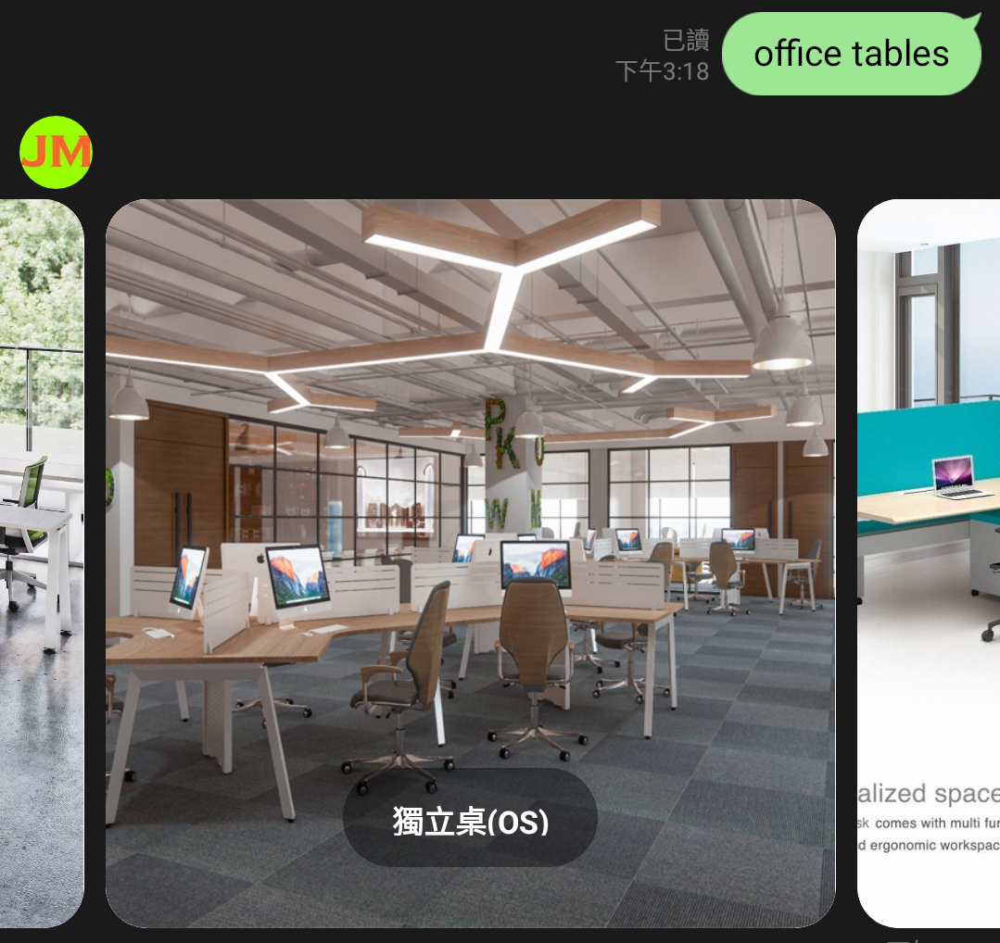
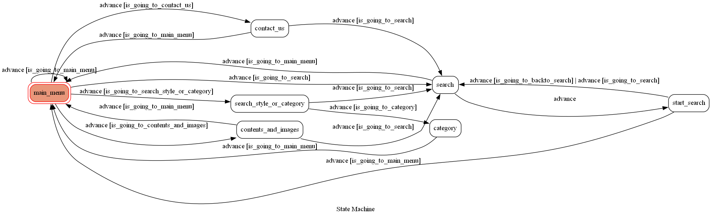

# 創立主旨
客人常常因為辦公室內需要選配許多辦公桌椅、各種辦公家具，但不知道自己偏好的顏色、樣式等等，而需要打電話詢問我們，為了讓客人可以隨時隨地且更有效率的參考公司的各種辦公桌椅目錄和圖片，或是使用線上的辦公室風格查詢，選定之後使用我們提供的線上詢價單來詢問，才創立這個機器人。

# 基本資訊
### 名稱: JoyMart 藝崴國際

### 以下是機器人的line ID，也可以透過掃描QR code加入好友:

### 功能選單:

#### 線上目錄: 我們提供的各種辦公家具目錄及圖片

#### 有3種，分為目錄、辦公桌、辦公椅及沙發

#### 聯絡我們: 各種聯絡資訊

#### 商品詢價: 連接至提供的詢價單

#### 辦公室風格參考: 線上參考辦公室的風格

#### 可查詢風格，有10種可供選擇，可輸入編號或風格名稱，輸入錯誤可以重新輸入:

#### 以下是其中一個風格的查詢結果

#### 查詢類別:

#### 家具保養Q&A: 各種辦公家具的操作及保養方式和問題

#### Show FSM: 這個機器人的有限狀態圖

# Finite State Machine
FSM使用**GraphMachine**產生，更多資訊請參考[transitions.extensions](https://github.com/pytransitions/transitions)，以下是這個機器人的FSM:

# References
部分資訊來自:
#### [DECO TV室內設計平台](https://decotv.com.tw)
#### [Office Snapshots](https://officesnapshots.com)

# TOC Final Project
> 2022/12/23 完成